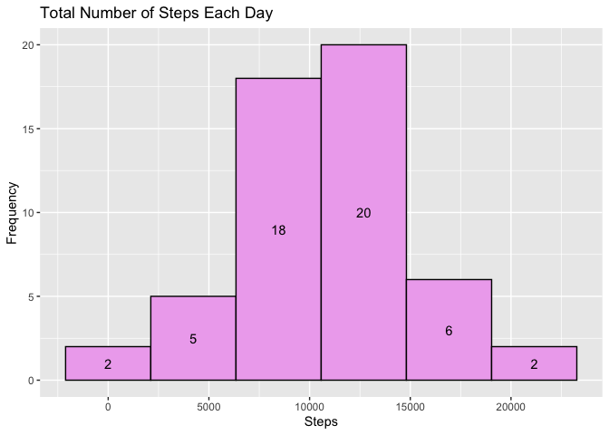
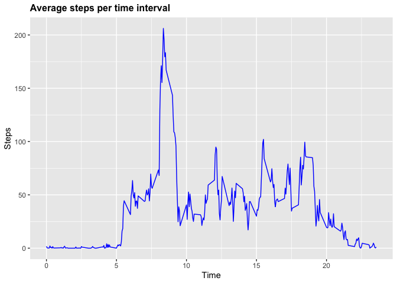
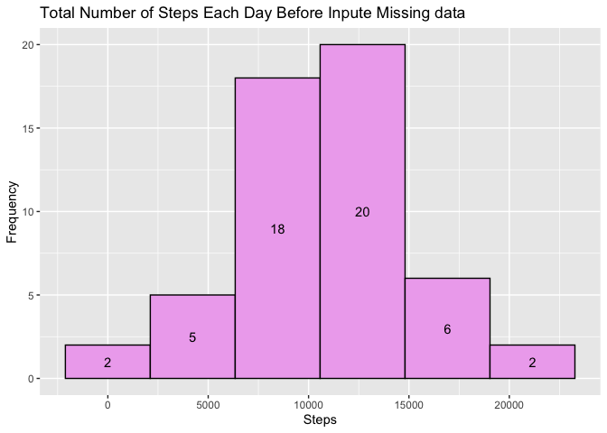
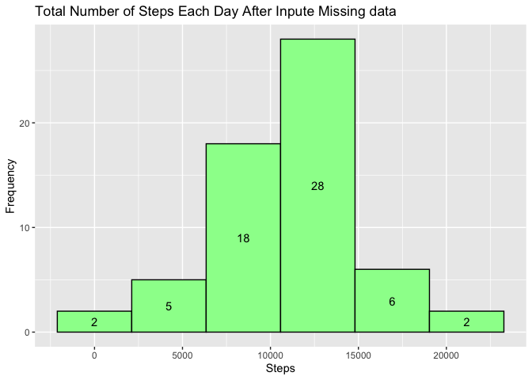
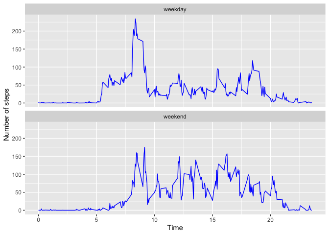

## 0 Load Library
Code for import plot library


```r
# Import Library
library(ggplot2)
library(lattice)
library(dplyr)
```

```
## 
## Attaching package: 'dplyr'
```

```
## The following objects are masked from 'package:stats':
## 
##     filter, lag
```

```
## The following objects are masked from 'package:base':
## 
##     intersect, setdiff, setequal, union
```


## 1 Loading and preprocessing the data

**1.1) Code for reading in the dataset**


```r
# Set directory
setwd("/Users/niko/Desktop/R/")

# Create Folder Data
if(!file.exists("data")){dir.create("data")}

# Download File
url = "https://d396qusza40orc.cloudfront.net/repdata%2Fdata%2Factivity.zip"
download.file(url, destfile = "./data/raw.zip", method = "curl")
unzip(zipfile = './data/raw.zip', exdir='./data')

# Read Data
activity <- read.csv("./data/activity.csv")
```

**1.2) Explore data**

```r
# Explore with head
head(activity)
```

```
##   steps       date interval
## 1    NA 2012-10-01        0
## 2    NA 2012-10-01        5
## 3    NA 2012-10-01       10
## 4    NA 2012-10-01       15
## 5    NA 2012-10-01       20
## 6    NA 2012-10-01       25
```


```r
# Explore data with str
str(activity)
```

```
## 'data.frame':	17568 obs. of  3 variables:
##  $ steps   : int  NA NA NA NA NA NA NA NA NA NA ...
##  $ date    : chr  "2012-10-01" "2012-10-01" "2012-10-01" "2012-10-01" ...
##  $ interval: int  0 5 10 15 20 25 30 35 40 45 ...
```


## 2 What is mean total number of steps taken per day?

**2.1) Histogram of the total number of steps taken each day**

```r
dayStep <- aggregate(steps ~ date, activity, sum, na.rm=TRUE)
colnames(dayStep) <- c("Date", "Steps")

dayStep %>%
  ggplot(aes(Steps)) +
  geom_histogram(bins = 6, color="black", fill="plum2") +
  ylab("Frequency")+
  ggtitle("Total Number of Steps Each Day")+
  stat_bin(bins=6, geom='text', color='black', aes(label=..count..),
           position=position_stack(vjust = 0.5))
```

<!-- -->

**2.2) Mean and median number of steps taken each day**

```r
# Mean number of steps taken each day
mean(dayStep$Steps)
```

```
## [1] 10766.19
```


```r
# Median number of steps taken each day
median(dayStep$Steps)
```

```
## [1] 10765
```

## 3 What is the average daily activity pattern?
**3.1) Time series plot of the average number of steps taken**


```r
timeStep <- aggregate(steps ~ interval, activity, mean, na.rm = TRUE)

p <- ggplot(timeStep, aes(interval/100, steps))+
        geom_line(col="blue")+
        ggtitle("Average steps per time interval")+
        xlab("Time")+
        ylab("Steps")+
        theme(plot.title = element_text(face="bold", size=12))
print(p)
```

<!-- -->


**3.2) The 5-minute interval that, on average, contains the maximum number of steps**

```r
timeStep[which.max(timeStep$steps),]
```

```
##     interval    steps
## 104      835 206.1698
```


## 4 Imputing missing values
**4.1) Code to describe and show a strategy for imputing missing data**

I use the average step on this interval.

**4.2) How many Missing Value**


```r
# How many missing?
missing = data.frame(steps = sum(is.na(activity$steps)),
                     date = sum(is.na(activity$date)),
                     interval = sum(is.na(activity$interval)))
missing
```

```
##   steps date interval
## 1  2304    0        0
```

**4.3) Impute missing data**


```r
impute <- activity

for(i in 1:dim(impute)[1]) {
        if(is.na(impute[i, 1]) == TRUE) {
                impute[i, 1] <- 
                        timeStep[timeStep$interval %in% impute[i, 3],  2]}}
```


**4.4) How many Missing Value after impute**

```r
# How many missing?
missingInpute = data.frame(steps = sum(is.na(impute$steps)),
                     date = sum(is.na(impute$date)),
                     interval = sum(is.na(impute$interval))) 

missingInpute
```

```
##   steps date interval
## 1     0    0        0
```

**4.5) Histogram of the total number of steps taken each day after missing values are imputed**


```r
dayStepImpute <- aggregate(steps ~ date, impute, sum, na.rm=TRUE)
colnames(dayStepImpute) <- c("Date", "Steps")


dayStep %>%
  ggplot(aes(Steps)) +
  geom_histogram(bins = 6, color="black", fill="plum2") +
  ylab("Frequency")+
  ggtitle("Total Number of Steps Each Day Before Inpute Missing data")+
  stat_bin(bins=6, geom='text', color='black', aes(label=..count..),
           position=position_stack(vjust = 0.5))
```

<!-- -->

```r
dayStepImpute %>%
  ggplot(aes(Steps)) +
  geom_histogram(bins = 6, color="black", fill="palegreen1") +
  ylab("Frequency")+
  ggtitle("Total Number of Steps Each Day After Inpute Missing data")+
  stat_bin(bins=6, geom='text', color='black', aes(label=..count..),
           position=position_stack(vjust = 0.5))
```

<!-- -->


```r
# Mean number of steps taken each day after Impute Missing Data
mean(dayStepImpute$Steps)
```

```
## [1] 10766.19
```


```r
# Median number of steps taken each day after Impute Missing Data
median(dayStepImpute$Steps)
```

```
## [1] 10766.19
```


## 5 Are there differences in activity patterns between weekdays and weekends?

**5.1 Panel plot comparing the average number of steps taken per 5-minute interval across weekdays and weekends**


```r
activity$date <- as.Date(activity$date)
activity$dayname <- weekdays(activity$date)
activity$weekend <- 
        as.factor(ifelse(activity$dayname == "Saturday" | 
                                 activity$dayname == "Sunday", "weekend", "weekday"))
```


```r
plotData <- aggregate(steps ~ interval + weekend, activity, mean)

ggplot(plotData, aes(interval/100, steps)) +
        geom_line(col="blue") + 
        xlab("") + 
        ylab("Number of steps") + 
        xlab("Time") + 
        facet_wrap(~ weekend, nrow = 2)
```

<!-- -->


